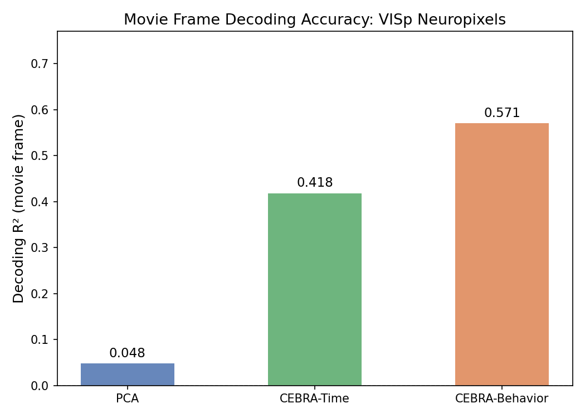
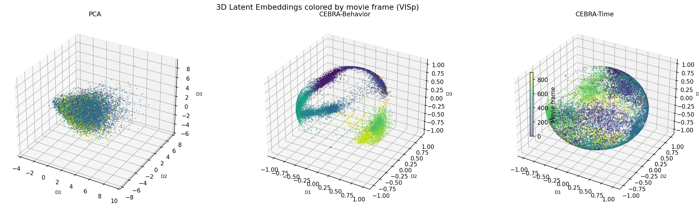

# Neural Decoding: CEBRA vs PCA

Final project for COGS 138 (UC San Diego). I compared PCA and CEBRA for decoding which movie frame a mouse was viewing from visual cortex (VISp) Neuropixels recordings.

## What I compared

- **PCA**: baseline linear dimensionality reduction
- **CEBRA-Time**: contrastive embeddings learned from temporal structure
- **CEBRA-Behavior**: contrastive embeddings learned using auxiliary labels
- Each method produced a 3D embedding, and I decoded movie frame from it using the same decoder and the same metric (R²).

## Result

On one VISp session, CEBRA-Behavior reached a decoding R² of 0.571 versus 0.048 for PCA, roughly a 12x improvement. CEBRA-Time reached 0.418.



The embeddings show why. PCA mixes movie frames together, while CEBRA-Behavior separates them into structured clusters along a curved manifold.



This is one session from one mouse, so I treat it as a result on this dataset and not a general claim about the methods.

## Data

Allen Brain Observatory Neuropixels (Visual Coding) recordings, one VISp session: [session ID]. The data is not included in this repo. The notebook downloads it through the [AllenSDK](https://allensdk.readthedocs.io/) on first run.

## Files

- `FinalProject_...ipynb`: full analysis
- `FinalProject_...html` / `.pdf`: rendered versions of the notebook
- `figures/`: plots used above

## Running it

```
pip install allensdk cebra scikit-learn numpy matplotlib
```
Open the notebook and run all cells. The first run is slow because of the data download.

## Tools

Python, CEBRA, scikit-learn, AllenSDK, NumPy, Matplotlib
